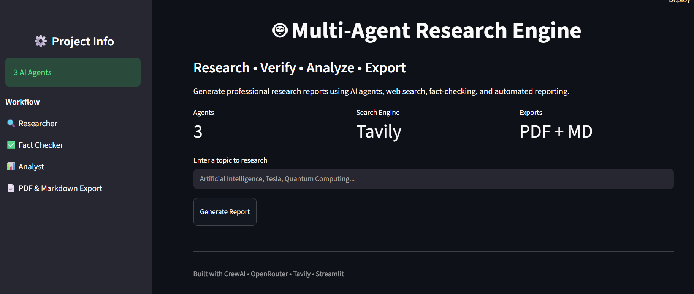

# 🤖 Multi-Agent Research Engine

An AI-powered research platform built with CrewAI, OpenRouter, Tavily, and Streamlit that performs automated web research, fact-checking, report generation, and PDF export through a multi-agent workflow.

## 🚀 Live Demo

**Try the application:**
https://multi-agent-research-engine-b4bygfwpfkwmvqtpgjf89n.streamlit.app/

## 📂 GitHub Repository

https://github.com/imvivek14/Multi-Agent-Research-Engine

---

## ✨ Features

* Multi-Agent AI Workflow using CrewAI
* Real-time Web Research with Tavily Search
* Automated Fact Checking
* Professional Report Generation
* PDF Export
* Markdown Export
* Interactive Streamlit Interface
* OpenRouter LLM Integration
* Downloadable Reports

---

## 🏗️ System Architecture

```text
User Query
     │
     ▼
Tavily Search
     │
     ▼
Research Agent
     │
     ▼
Fact Checker Agent
     │
     ▼
Analyst Agent
     │
     ▼
Final Report
     ├── Markdown Export
     └── PDF Export
```

---

## 📸 Application Dashboard



---

## 🛠️ Tech Stack

* Python
* CrewAI
* OpenRouter
* Tavily Search API
* Streamlit
* ReportLab
* Git & GitHub

---

## 🧠 Agents

### Research Agent

Collects and analyzes information from web sources.

### Fact Checker Agent

Verifies findings and improves information reliability.

### Analyst Agent

Transforms validated research into a professional report.

---

## ⚙️ Installation

```bash
git clone https://github.com/imvivek14/Multi-Agent-Research-Engine.git
cd Multi-Agent-Research-Engine

python -m venv venv
venv\Scripts\activate

pip install -r requirements.txt
```

Create a `.env` file:

```env
OPENROUTER_API_KEY=your_key
TAVILY_API_KEY=your_key
```

Run the application:

```bash
streamlit run app.py
```

---

## 📈 Skills Demonstrated

* Multi-Agent Systems
* AI Workflow Orchestration
* LLM Integration
* Prompt Engineering
* API Integration
* Streamlit Development
* Git & GitHub
* AI Application Deployment

---

## 🎯 Future Improvements

* Citation Tracking
* Research History Dashboard
* Multiple Report Templates
* Database Integration
* User Authentication
* Team Collaboration Features

---

## 👨‍💻 Author

**Vivek Surati**

AI & Software Developer
